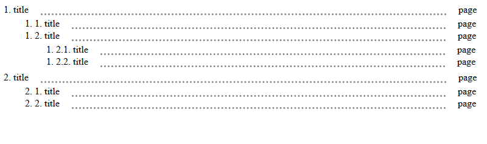
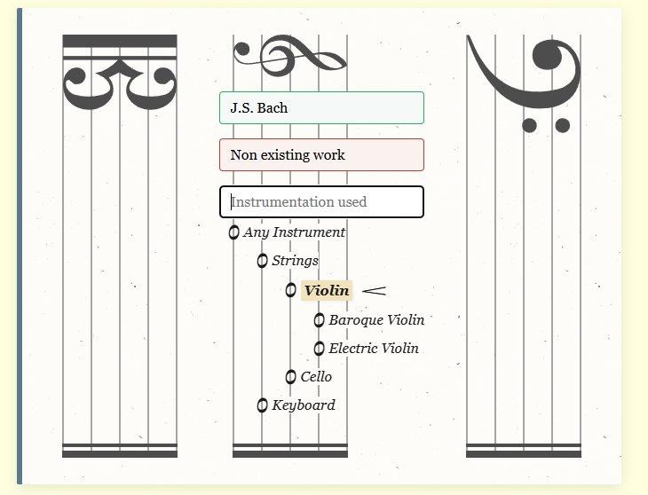
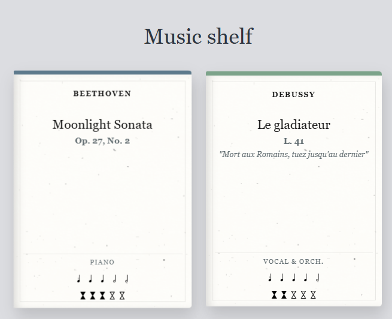
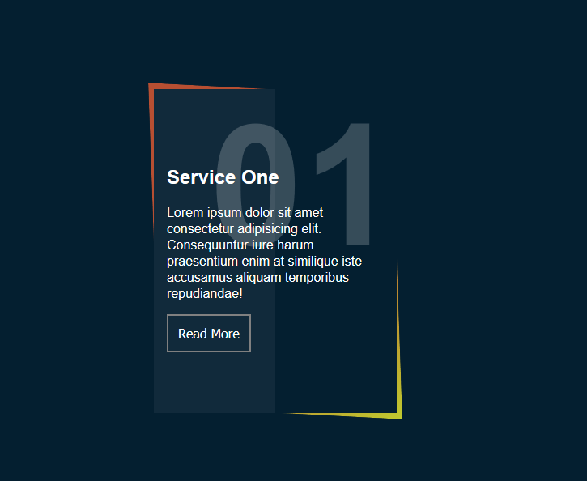
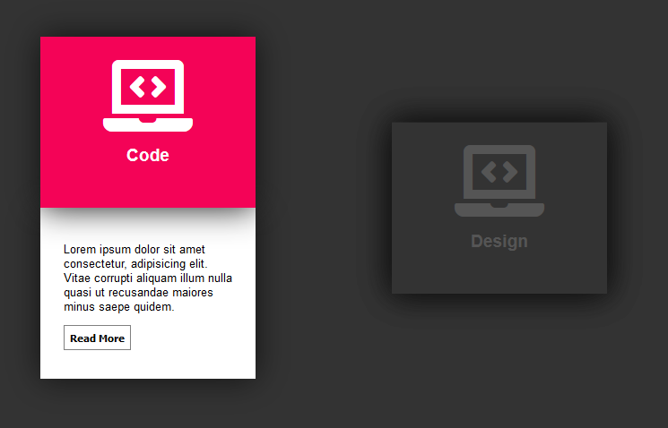

# html-css-examples
Collection of examples

## Index component

Check it on [Index component](https://juaamol.github.io/html-css-examples/index-component/index-component.html "Index component")

### Index component [EN]

Index with dots.

Basically nested tables where each row between 3 or 4 elements (td).

Each tr is displayed using flex

The second td grows to fill the content. Second td also have a border bottom dotted.

The fourth element, if it exists, must be a table which will be used as a sublevel.

### Index component [ES]

Índice con puntos.

Simplemente tablas anidadas con filas de entre 3 y 4 elementos. 

Cada fila (tr) utiliza display: flex;

El segundo elemento (td) de una fila está vacio, pero sirve para dibujar los puntos. Este elemento crece lo necesario para llenar el contenedor.

El cuarto elemento, si existe, debe ser una tabla (table) dentro de un elemento (td). La tabla será un subnivel. 

## Music themed tree

List that displays items with a "Music Sheet" style

Check it on [Music themed tree](https://juaamol.github.io/html-css-examples/music-themed-tree/music-themed-tree.html "Music themed tree")

### Music Shelf

List that displays cards with a "Music Book" style

Check it on [Music Shelf](https://juaamol.github.io/html-css-examples/music-shelf/music-shelf.html "Music Shelf")

## Dual Card  

Check it on [Dual card](https://juaamol.github.io/html-css-examples/dual-card/dual-card.html "Dual card")

Card with two diferent colors. Button appears on hover

## Open Close Card

Check it on [Open Close card](https://juaamol.github.io/html-css-examples/open-card/open-card.html "Open Close card")

## Login form

Check it on [Login form](https://juaamol.github.io/html-css-examples/login-form/login-form.html "Login form")

Based on: https://www.youtube.com/watch?v=OWNxUVnY3pg

## Circle menu

Check it on [Circle menu](https://juaamol.github.io/html-css-examples/game-radial-menu/game-radial-menu.html "Circle menu")

